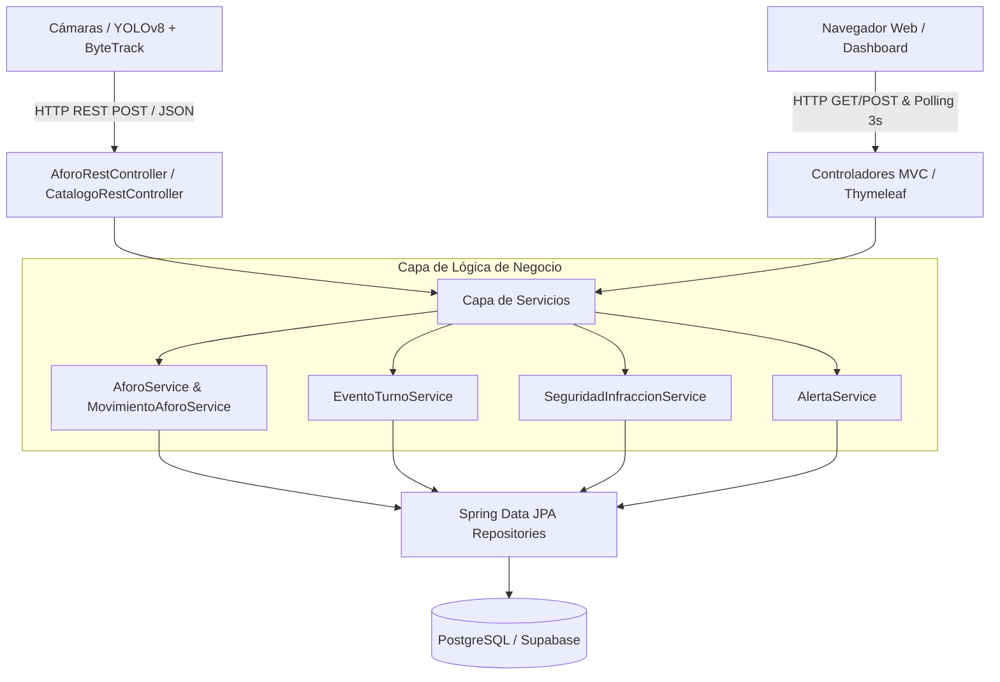

# 🛡️ MineSentinel — Sistema Integral de Seguridad y Control de Aforo Minero

MineSentinel es una plataforma industrial backend y frontend construida con **Java 17/26**, **Spring Boot 3.3.4**, **Spring Data JPA**, **PostgreSQL** y **Thymeleaf**, diseñada para la supervisión y control de aforo, gestión de turnos concurrentes e ingesta en tiempo real de eventos de visión artificial (**YOLOv8 + ByteTrack**).

---

## 📑 Tabla de Contenidos
1. [Visión General y Arquitectura](#-visión-general-y-arquitectura)
2. [Estructura del Proyecto](#-estructura-del-proyecto)
3. [Modelo de Datos y Entidades](#-modelo-de-datos-y-entidades)
4. [Lógica de Negocio y Servicios](#-lógica-de-negocio-y-servicios)
5. [Endpoints de la API REST](#-endpoints-de-la-api-rest)
6. [Frontend e Integración en Tiempo Real](#-frontend-e-integración-en-tiempo-real)
7. [Seguridad y Autenticación](#-seguridad-y-autenticación)
8. [Suite de Pruebas Unitarias](#-suite-de-pruebas-unitarias)
9. [Instalación, Configuración y Ejecución](#-instalación-configuración-y-ejecución)

---

## 🏗️ Visión General y Arquitectura

MineSentinel implementa una arquitectura en capas limpia y orientada al dominio industrial:



### Principios Clave de Diseño:
- **Append-Only Event Ledger**: Los movimientos de personal (`MovimientoAforo`) no modifican contadores mutables en la base de datos; se registran como eventos inmutables en el ledger. El aforo actual se calcula dinámicamente mediante agregaciones SQL optimizadas (`COUNT` filtrado).
- **Manejo de Solapamiento de Turnos**: Durante el cambio de guardia, múltiples turnos pueden estar en estado `ACTIVO` simultáneamente. La lógica de resolución asigna automáticamente las `ENTRADA` al turno entrante y las `SALIDA` al turno saliente.
- **Filtrado Estricto de Aforo**: Se utiliza la propiedad `requiere_aforo` en `RolPersonal` para discriminar personal que impacta la capacidad física de la mina (operadores, técnicos) de visitantes o inspectores temporales.

---

## 📁 Estructura del Proyecto

```
com.sentinelmine
├── SentinelMineApplication.java         # Clase principal / Entry point Spring Boot
├── config/
│   └── SecurityConfig.java              # Configuración de BCrypt y seguridad HTTP
├── controller/
│   ├── AforoRestController.java         # API REST para YOLOv8 y consumo SPA
│   ├── AuthController.java              # Login y gestión de sesiones
│   ├── CamaraController.java            # Visualización de cámaras y streams
│   ├── CatalogoRestController.java      # Catálogos de EPP y anomalías
│   ├── DashboardController.java         # Vista principal del Centro de Control
│   ├── HistorialController.java         # Historial de eventos y auditoría
│   └── PanelAdminController.java        # Administración de turnos y seguridad
├── dto/
│   ├── AforoDTO.java                    # DTO de aforo y balance
│   ├── AlertaViewDTO.java               # DTO para renderizado de alertas
│   ├── ResultadoDeteccionDTO.java       # DTO para procesamiento de visión
│   ├── request/
│   │   ├── AnomaliaRequestDTO.java      # Payload para anomalías de movimiento
│   │   ├── FaltaEPPRequestDTO.java      # Payload para infracciones de EPP
│   │   └── MovimientoRequestDTO.java    # Payload para cruces de aforo
│   └── response/
│       ├── AforoGlobalResponseDTO.java  # Respuesta agregada en tiempo real
│       ├── CierreTurnoResponseDTO.java  # Resultado del cierre y auditoría
│       └── ErrorResponseDTO.java        # Formato estándar de errores
├── entity/
│   ├── AnomaliaMovimiento.java          # Registro de anomalías de movimiento
│   ├── CatalogoAnomalias.java           # Catálogo maestro de anomalías
│   ├── CatalogoEPP.java                 # Catálogo maestro de tipos de EPP
│   ├── CierreAuditoriaTurno.java        # Auditoría inmutable de cierre de turno
│   ├── EventoTurno.java                 # Instancia operativa de turno ejecutado
│   ├── FaltaEPP.java                    # Registro de faltas de EPP
│   ├── MovimientoAforo.java             # Event Ledger de entradas/salidas
│   ├── RolPersonal.java                 # Roles (Operador, Supervisor, etc.)
│   ├── Turno.java                       # Plantilla de turno (Día, Noche, Mixto)
│   ├── Usuario.java                     # Credenciales y roles de acceso
│   └── enums/
│       ├── EstadoAlerta.java            # PENDIENTE, REVISADA, DESCARTADA
│       ├── EstadoTurno.java             # ACTIVO, CERRADO, CANCELADO
│       └── TipoMovimiento.java          # ENTRADA, SALIDA
├── exception/
│   └── GlobalExceptionHandler.java      # Manejador global de excepciones REST
├── repository/                          # Repositorios Spring Data JPA
└── service/
    ├── AforoService.java                # Métodos de cálculo de aforo
    ├── AlertaService.java               # Gestión de incidentes y alertas
    ├── BrowserLauncherService.java      # Apertura automática de navegador en local
    ├── DatabaseInitializerService.java  # Carga de datos iniciales y seed
    ├── DeteccionEppService.java          # Lógica de detección de EPP
    ├── EventoTurnoService.java          # Apertura, cierre y auditoría de turnos
    ├── MovimientoAforoService.java      # Ingesta en Event Ledger
    └── SeguridadInfraccionService.java  # Ingesta de faltas EPP y anomalías
```

---

## 🗄️ Modelo de Datos y Entidades

### 1. `turnos` & `eventos_turno`
- **`Turno`**: Define la plantilla de horario (ej. *Turno Guardia Día* de 07:00 a 19:00).
- **`EventoTurno`**: Representa la ejecución real de un turno en una fecha determinada.
  - `estado`: `ACTIVO`, `CERRADO`, `CANCELADO`.
  - `fecha_inicio`, `fecha_fin`: Marcas temporales de operación.

### 2. `cierres_auditoria_turno`
Registro inmutable generado al invocar el cierre de un `EventoTurno`:
- `total_entradas`: Total de cruces `ENTRADA` con `requiere_aforo = true`.
- `total_salidas`: Total de cruces `SALIDA` con `requiere_aforo = true`.
- `diferencia`: `total_entradas - total_salidas`. Un valor $\neq 0$ indica personal que no registró salida al terminar el turno.
- `observaciones`: Notas o justificación del supervisor.

### 3. `movimientos_aforo` (Event Ledger)
- `tipo_movimiento`: `ENTRADA` | `SALIDA`.
- `track_id`: Identificador numérico del objeto rastreado por ByteTrack.
- `evento_id`: Clave foránea al `EventoTurno` activo correspondiente.
- `rol_id`: Rol detectado o asignado (`RolPersonal`).
- `timestamp`: Momento exacto del cruce.

### 4. `faltas_epp` & `anomalias_movimiento`
- Almacenan infracciones de seguridad detectadas por las cámaras.
- Incluyen `nivel_confianza` ($0.00$ a $1.00$), `snapshot_url` (ruta o URL de la imagen de evidencia) y `estado_alerta` inicial (`PENDIENTE`).

---

## ⚙️ Lógica de Negocio y Servicios

### `EventoTurnoService`
1. **`abrirTurno(Long turnoId, String usuario)`**:
   - Utiliza nivel de aislamiento `@Transactional(isolation = Isolation.READ_COMMITTED)`.
   - Permite abrir un nuevo turno aunque existan turnos previos en estado `ACTIVO`, facilitando el solapamiento durante el relevo de guardia.
2. **`cerrarTurno(Long eventoId, String observaciones, String usuario)`**:
   - Cierra atómicamente el turno especificado.
   - Realiza el cálculo del balance de aforo contabilizando exclusivamente movimientos con `requiere_aforo = true`.
   - Persiste la entidad `CierreAuditoriaTurno` y actualiza el estado a `CERRADO`.
3. **`resolverEventoActivoParaMovimiento(TipoMovimiento tipo)`**:
   - Si no hay solapamiento, devuelve el único turno activo.
   - En solapamiento:
     - `ENTRADA` $\rightarrow$ Asigna al turno más reciente (nuevo personal ingresando).
     - `SALIDA` $\rightarrow$ Asigna al turno más antiguo (personal del turno saliente).

### `MovimientoAforoService`
- Registra cada cruce con validación de existencia de turnos activos.
- En caso de que el cliente YOLOv8 no envíe `evento_id`, invoca `resolverEventoActivoParaMovimiento` para imputar el evento correctamente.

### `SeguridadInfraccionService`
- Ingesta infracciones (`FaltaEPP` y `AnomaliaMovimiento`).
- Vincula automáticamente el evento al turno activo si no es provisto explícitamente en el payload.

---

## 🚀 Endpoints de la API REST

### 1. Control de Aforo y Movimientos
| Método | Ruta | Descripción | Payload / Parámetros |
| :--- | :--- | :--- | :--- |
| `POST` | `/api/v1/aforo/movimiento` | Registra cruce de aforo | `{"tipoMovimiento": "ENTRADA", "trackId": 101, "rolId": 1}` |
| `GET` | `/api/v1/aforo/tiempo-real` | Métricas actuales de aforo | Respuesta: Aforo actual, entradas, salidas, desglose |
| `GET` | `/api/v1/aforo/dashboard` | Resumen para panel principal | Respuesta: Resumen general y estado de turnos |

### 2. Seguridad e Infracciones (YOLOv8)
| Método | Ruta | Descripción | Payload / Parámetros |
| :--- | :--- | :--- | :--- |
| `POST` | `/api/v1/seguridad/faltas-epp` | Registra infracción de EPP | `{"tipoEppId": 1, "nivelConfianza": 0.94, "snapshotUrl": "/evidencias/epp_101.jpg"}` |
| `POST` | `/api/v1/seguridad/anomalias` | Registra anomalía de movimiento | `{"tipoAnomaliaId": 2, "nivelConfianza": 0.88, "snapshotUrl": "/evidencias/anom_102.jpg"}` |
| `GET` | `/api/v1/alertas/recientes` | Alertas recientes | Lista de incidentes pendientes y recientes |

### 3. Gestión de Turnos y Auditoría
| Método | Ruta | Descripción | Payload / Parámetros |
| :--- | :--- | :--- | :--- |
| `POST` | `/api/v1/turnos/abrir` | Inicia un nuevo turno | `?turnoId=1&usuario=admin` |
| `POST` | `/api/v1/turnos/{eventoId}/cerrar` | Cierra y audita el turno | `?observaciones=Relevo+normal&usuario=admin` |
| `GET` | `/api/v1/turnos/activos` | Lista turnos actualmente activos | Array de `EventoTurno` |

---

## 🖥️ Frontend e Integración en Tiempo Real

Las vistas Thymeleaf se encuentran en `src/main/resources/templates/`:
- **`dashboard.html`**: Centro de mando con tarjetas de KPI (Aforo actual, personal en interior, balance de turno, cámaras activas) y tabla de alertas en vivo.
- **`panel-admin.html`**: Gestión de turnos, apertura/cierre de guardia, historial de auditorías y configuración.
- **`camara.html`**: Visualización de streams de video e inferencia en tiempo real.
- **`historial.html`**: Consulta histórica de cruces de aforo y exportación de reportes.
- **`login.html`**: Pantalla de autenticación corporativa.

### Actualización Asíncrona (Background Polling)
El frontend incluye scripts JavaScript que realizan consultas periódicas cada **3 segundos** a `/api/v1/aforo/tiempo-real` y `/api/v1/alertas/recientes`, actualizando el DOM dinámicamente sin necesidad de recargar la página.

---

## 🔒 Seguridad y Autenticación

- **`SecurityConfig`**: Configuración de `BCryptPasswordEncoder` para el hash seguro de contraseñas.
- **Control de Acceso**:
  - `ADMIN`: Acceso total al panel administrativo, gestión de turnos y configuración.
  - `SUPERVISOR`: Monitoreo de dashboard, cámaras y cierre de turnos.
  - `OPERADOR`: Visualización de alertas y dashboard.
- **Credenciales por Defecto**:
  - Usuario: `admin`
  - Contraseña: `sentinel123`

---

## 🧪 Suite de Pruebas Unitarias

La suite de pruebas automatizadas está construida con **JUnit Jupiter 5** y **Mockito**:

- **`AforoDTOTest`**: Valida constructores y cálculos derivados del balance de aforo.
- **`EntityMappingTest`**: Verifica el mapeo JPA, relaciones de clave foránea y comportamiento de enumeraciones.
- **`EventoTurnoServiceTest`**:
  - Apertura de turnos con y sin solapamiento previo.
  - Cierre y cálculo atómico de auditoría excluyendo `requiere_aforo = false`.
  - Algoritmo de resolución de turnos durante solapamiento.
  - Excepciones ante turnos inexistentes o ya cerrados.
- **`MovimientoAforoServiceTest`**:
  - Inserción en Event Ledger y resolución automática de turno activo.
  - Validación de excepción cuando no existen turnos activos en operación.

### Ejecución de Pruebas:
```powershell
.\mvnw.cmd test
```

---

## 🚀 Instalación, Configuración y Ejecución

### 1. Prerrequisitos
- **Java Development Kit (JDK)**: Versión 17 o superior (compatible con Java 21/26).
- **Base de Datos**: PostgreSQL 14+ (o instancia remota en Supabase).

### 2. Configuración (`application.properties`)
Ubicación: `src/main/resources/application.properties`
```properties
spring.datasource.url=jdbc:postgresql://<HOST>:<PORT>/<DATABASE>
spring.datasource.username=<USUARIO>
spring.datasource.password=<PASSWORD>
spring.jpa.hibernate.ddl-auto=update
spring.jpa.show-sql=false
```

### 3. Compilación y Ejecución
```powershell
# Compilar el proyecto y ejecutar los tests
.\mvnw.cmd clean test

# Iniciar la aplicación en modo desarrollo
.\mvnw.cmd spring-boot:run
```

La aplicación estará disponible en `http://localhost:8080/login`.
