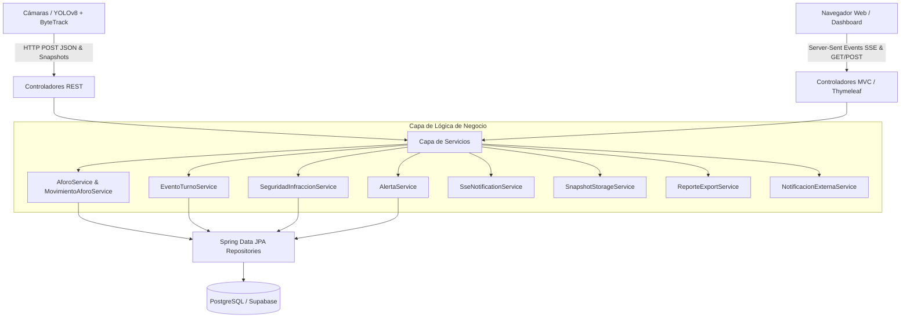

# 🛡️ MineSentinel — Sistema Integral de Seguridad y Control de Aforo Minero

MineSentinel es una plataforma industrial backend y frontend construida con **Java 17/26**, **Spring Boot 3.3.4**, **Spring Data JPA**, **PostgreSQL** y **Thymeleaf**, diseñada para la supervisión y control de aforo, gestión de turnos concurrentes e ingesta en tiempo real de eventos de visión artificial (**YOLOv8 + ByteTrack**).

---

## 📑 Tabla de Contenidos
1. [Visión General y Arquitectura](#-visión-general-y-arquitectura)
2. [Estructura del Proyecto](#-estructura-del-proyecto)
3. [Modelo de Datos y Entidades](#-modelo-de-datos-y-entidades)
4. [Lógica de Negocio y Servicios](#-lógica-de-negocio-y-servicios)
5. [Endpoints de la API REST](#-endpoints-de-la-api-rest)
6. [Frontend, Streaming SSE y Reportes](#-frontend-streaming-sse-y-reportes)
7. [Seguridad y Autenticación](#-seguridad-y-autenticación)
8. [Cliente Python de Integración (YOLOv8)](#-cliente-python-de-integración-yolov8)
9. [Suite de Pruebas Unitarias](#-suite-de-pruebas-unitarias)
10. [Instalación, Configuración y Ejecución](#-instalación-configuración-y-ejecución)

---

## 🏗️ Visión General y Arquitectura

MineSentinel implementa una arquitectura en capas orientada al dominio industrial de alta concurrencia y tolerancia a fallos:



### Principios Clave de Diseño:
- **Append-Only Event Ledger**: Los movimientos de personal (`MovimientoAforo`) no modifican contadores mutables en la base de datos; se registran como eventos inmutables en el ledger. El aforo actual se calcula dinámicamente mediante agregaciones SQL optimizadas (`COUNT` filtrado).
- **Manejo de Solapamiento de Turnos**: Durante el cambio de guardia, múltiples turnos pueden estar en estado `ACTIVO` simultáneamente. La lógica de resolución asigna automáticamente las `ENTRADA` al turno entrante y las `SALIDA` al turno saliente.
- **Filtrado Estricto de Aforo**: Se utiliza la propiedad `requiere_aforo` en `RolPersonal` para discriminar personal que impacta la capacidad física de la mina (operadores, técnicos) de visitantes o inspectores temporales.
- **Streaming Instantáneo (SSE)**: Transmisión push en tiempo real (<50ms) hacia los tableros de control ante cualquier cruce o infracción detectada.

---

## 📁 Estructura del Proyecto

```
com.sentinelmine
├── SentinelMineApplication.java         # Clase principal / Entry point Spring Boot
├── config/
│   ├── AuthInterceptor.java             # Interceptor de seguridad para rutas web
│   ├── SecurityConfig.java              # Configuración de BCrypt y seguridad HTTP
│   └── WebMvcConfig.java                # Registro de interceptores MVC
├── controller/
│   ├── AforoRestController.java         # API REST para YOLOv8 y consumo SPA
│   ├── AuthController.java              # Login y gestión de sesiones
│   ├── CamaraController.java            # Visualización de cámaras y streams
│   ├── CatalogoRestController.java      # Catálogos de EPP y anomalías
│   ├── DashboardController.java         # Vista principal del Centro de Control
│   ├── HistorialController.java         # Historial de eventos y exportación CSV
│   ├── PanelAdminController.java        # Administración de turnos y actas oficiales
│   ├── SnapshotRestController.java      # Carga y servicio de evidencias fotográficas
│   └── StreamRestController.java        # Streaming Server-Sent Events (SSE)
├── dto/
│   ├── AforoDTO.java                    # DTO de aforo y balance
│   ├── AlertaViewDTO.java               # DTO para renderizado de alertas
│   ├── ResultadoDeteccionDTO.java       # DTO para procesamiento de visión
│   ├── request/
│   │   ├── AnomaliaRequestDTO.java      # Payload para anomalías de movimiento
│   │   ├── FaltaEPPRequestDTO.java      # Payload para infracciones de EPP
│   │   └── MovimientoRequestDTO.java    # Payload para cruces de aforo
│   └── response/
│       ├── AforoGlobalResponseDTO.java  # Respuesta agregada en tiempo real
│       ├── CierreTurnoResponseDTO.java  # Resultado del cierre y auditoría
│       └── ErrorResponseDTO.java        # Formato estándar de errores
├── entity/                              # Entidades JPA (Turno, MovimientoAforo, FaltaEPP, etc.)
├── repository/                          # Repositorios Spring Data JPA
└── service/
    ├── AforoService.java                # Métodos de cálculo de aforo
    ├── AlertaService.java               # Gestión de incidentes y alertas
    ├── BrowserLauncherService.java      # Apertura automática de navegador en local
    ├── DatabaseInitializerService.java  # Carga de datos iniciales y seed
    ├── DeteccionEppService.java          # Lógica de detección de EPP
    ├── EventoTurnoService.java          # Apertura, cierre y auditoría de turnos
    ├── MovimientoAforoService.java      # Ingesta en Event Ledger y emisión SSE
    ├── NotificacionExternaService.java  # Despacho de alertas a supervisores
    ├── ReporteExportService.java        # Exportación CSV y Actas Oficiales PDF/HTML
    ├── SeguridadInfraccionService.java  # Ingesta de faltas EPP y anomalías
    ├── SnapshotStorageService.java      # Almacenamiento local de fotos de evidencia
    └── SseNotificationService.java      # Servidor push Server-Sent Events

python_client/
├── yolo_sentinel_client.py              # Script de inferencia y simulación continua
├── requirements.txt                     # Dependencias Python (requests, opencv, ultralytics)
└── README.md                            # Guía de ejecución del cliente Python
```

---

## 🗄️ Modelo de Datos y Entidades

### 1. `turnos` & `eventos_turno`
- **`Turno`**: Define la plantilla de horario (ej. *Turno Guardia Día* de 07:00 a 19:00).
- **`EventoTurno`**: Representa la ejecución real de un turno en una fecha determinada.
  - `estado`: `ACTIVO`, `CERRADO`, `CANCELADO`.
  - `fecha_inicio`, `fecha_fin`: Marcas temporales de operación.

### 2. `cierres_auditoria_turno`
Registro inmutable generado al invocar el cierre de un `EventoTurno`:
- `total_entradas`: Total de cruces `ENTRADA` con `requiere_aforo = true`.
- `total_salidas`: Total de cruces `SALIDA` con `requiere_aforo = true`.
- `diferencia`: `total_entradas - total_salidas`. Un valor $\neq 0$ indica personal que no registró salida al terminar el turno.
- `observaciones`: Notas o justificación del supervisor.

### 3. `movimientos_aforo` (Event Ledger)
- `tipo_movimiento`: `ENTRADA` | `SALIDA`.
- `track_id`: Identificador numérico del objeto rastreado por ByteTrack.
- `evento_id`: Clave foránea al `EventoTurno` activo correspondiente.
- `rol_id`: Rol detectado o asignado (`RolPersonal`).
- `timestamp`: Momento exacto del cruce.

### 4. `faltas_epp` & `anomalias_movimiento`
- Almacenan infracciones de seguridad detectadas por las cámaras.
- Incluyen `nivel_confianza` ($0.00$ a $1.00$), `snapshot_url` (ruta o URL de la imagen de evidencia) y `estado_alerta` inicial (`PENDIENTE`).

---

## ⚙️ Lógica de Negocio y Servicios

### `EventoTurnoService`
1. **`abrirTurno(Long turnoId, LocalDateTime fechaInicio)`**:
   - Nivel de aislamiento `@Transactional(isolation = Isolation.READ_COMMITTED)`.
   - Permite solapamiento de turnos durante el cambio de guardia y emite evento SSE `turno-update`.
2. **`cerrarTurno(Long eventoId)`**:
   - Cierre atómico, conciliación estricta de aforo (`requiere_aforo = true`) y registro inmutable en `cierres_auditoria_turno`.
3. **`resolverEventoActivoParaMovimiento(LocalDateTime fechaHora, TipoMovimiento tipo)`**:
   - Asigna inteligentemente las entradas a la guardia entrante y las salidas a la saliente durante solapamientos.

### `SseNotificationService`
- Gestiona conexiones de streaming HTTP unidireccional y envía notificaciones instantáneas de eventos a todos los tableros web suscritos.

### `SnapshotStorageService`
- Almacena evidencias visuales en el directorio de almacenamiento (`./uploads/snapshots/`) y las sirve de forma segura como recurso web.

### `ReporteExportService`
- Genera archivos CSV compatibles con Microsoft Excel y el Acta Oficial de Reconciliación de Guardia formateada para impresión o descarga PDF.

---

## 🚀 Endpoints de la API REST

### 1. Control de Aforo y Movimientos
| Método | Ruta | Descripción | Payload / Parámetros |
| :--- | :--- | :--- | :--- |
| `POST` | `/api/v1/aforo/movimiento` | Registra cruce de aforo | `{"tipoMovimiento": "ENTRADA", "trackId": 101, "rolId": 1}` |
| `GET` | `/api/v1/aforo/tiempo-real` | Métricas actuales de aforo | Respuesta: Aforo actual, entradas, salidas, desglose |
| `GET` | `/api/v1/aforo/dashboard` | Resumen para panel principal | Respuesta: Resumen general y estado de turnos |

### 2. Seguridad e Infracciones (YOLOv8)
| Método | Ruta | Descripción | Payload / Parámetros |
| :--- | :--- | :--- | :--- |
| `POST` | `/api/v1/seguridad/faltas-epp` | Registra infracción de EPP | `{"eppId": 1, "rolId": 1, "nivelConfianza": 0.94, "snapshotUrl": "..."}` |
| `POST` | `/api/v1/seguridad/anomalias` | Registra anomalía de movimiento | `{"catalogoAnomaliaId": 2, "rolId": 1, "nivelConfianza": 0.88, "snapshotUrl": "..."}` |
| `POST` | `/api/v1/evidencias/upload` | Sube fotografía de evidencia | Form Data: `file` (imagen multipart) |
| `GET` | `/api/v1/evidencias/{filename}` | Descarga o visualiza evidencia | Devuelve stream de imagen (`image/jpeg`) |

### 3. Streaming en Tiempo Real (SSE)
| Método | Ruta | Descripción | Tipo de Respuesta |
| :--- | :--- | :--- | :--- |
| `GET` | `/api/v1/stream/eventos` | Suscripción a eventos en tiempo real | `text/event-stream` (`aforo-update`, `alerta-nueva`, `turno-update`) |

### 4. Reportes y Auditoría
| Método | Ruta | Descripción | Tipo de Respuesta |
| :--- | :--- | :--- | :--- |
| `GET` | `/historial/exportar/csv` | Descarga de historial en CSV | Archivo descargable `.csv` |
| `GET` | `/panel-admin/turnos/{id}/acta` | Visualización e impresión de Acta Oficial | HTML imprimible / Guardar PDF |

---

## 🖥️ Frontend, Streaming SSE y Reportes

- **`dashboard.html`**: Tablero principal conectado a Server-Sent Events con soporte de refresco instantáneo y polling de respaldo cada 3s.
- **`panel-admin.html`**: Panel de supervisión con botón de despacho de alertas a jefes de turno y enlace al Acta Oficial de Cierre.
- **`camara.html`**: Monitor de cámara en boca-mina con detección de pose/rostro y panel de prueba de EPP.
- **`historial.html`**: Tabla completa de eventos con botón de **Exportar Historial a CSV (Excel)**.
- **`login.html`**: Acceso seguro corporativo con validación BCrypt y sesiones HTTP.

---

## 🐍 Cliente Python de Integración (YOLOv8)

Ubicado en el directorio `python_client/`:
```bash
cd python_client
pip install -r requirements.txt

# Ejecutar en modo simulación industrial continua:
python yolo_sentinel_client.py --mode simulation --interval 3
```

---

## 🧪 Suite de Pruebas Unitarias (30 Tests)

La suite de pruebas automatizadas está construida con **JUnit Jupiter 5** y **Mockito**:

- **`AforoDTOTest`** (2 tests): Cálculos y balances de aforo.
- **`EntityMappingTest`** (4 tests): Mapeo JPA, claves foráneas y enums.
- **`EventoTurnoServiceTest`** (8 tests): Solapamiento, apertura, cierre atómico y balance de auditoría.
- **`MovimientoAforoServiceTest`** (4 tests): Ingesta en Event Ledger y resolución de turno.
- **`SeguridadInfraccionServiceTest`** (4 tests): Ingesta de faltas EPP, anomalías y transiciones de estado.
- **`SnapshotStorageServiceTest`** (3 tests): Almacenamiento Multipart, Base64 y validaciones de archivo.
- **`SseNotificationServiceTest`** (2 tests): Conexión de clientes SSE y emisión de eventos.
- **`ReporteExportServiceTest`** (3 tests): Exportación CSV de alertas, movimientos y Acta Oficial.

### Ejecución de Pruebas:
```powershell
.\mvnw.cmd test
```

---

## 🚀 Instalación, Configuración y Ejecución

### 1. Prerrequisitos
- **Java Development Kit (JDK)**: Versión 17 o superior (compatible con Java 21/26).
- **Base de Datos**: PostgreSQL 14+ (o instancia en Supabase).

### 2. Ejecutar Pruebas y Compilar
```powershell
.\mvnw.cmd test
```

### 3. Iniciar la Aplicación Spring Boot
```powershell
.\mvnw.cmd spring-boot:run
```

- **URL de Acceso**: `http://localhost:8080/login`
- **Usuario**: `admin`
- **Contraseña**: `sentinel123`
